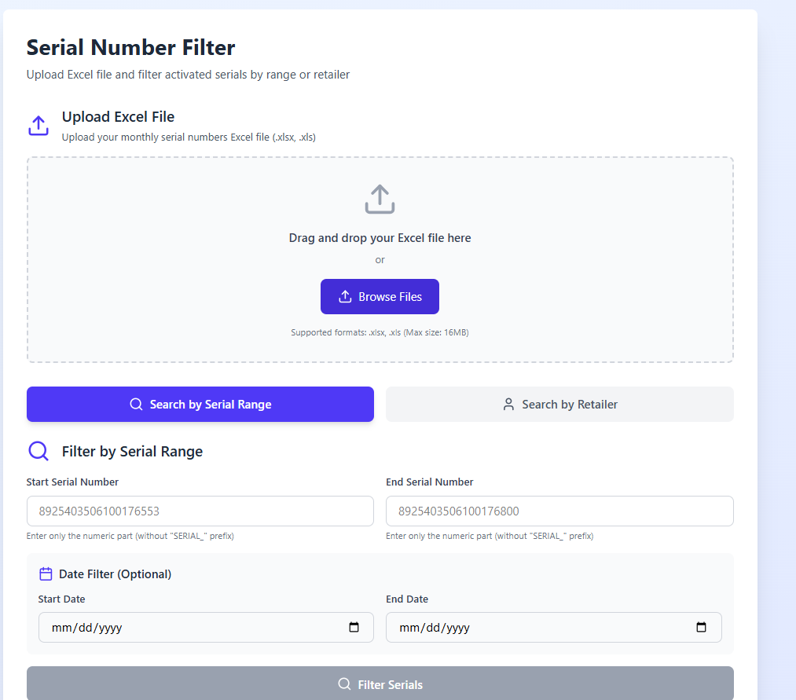
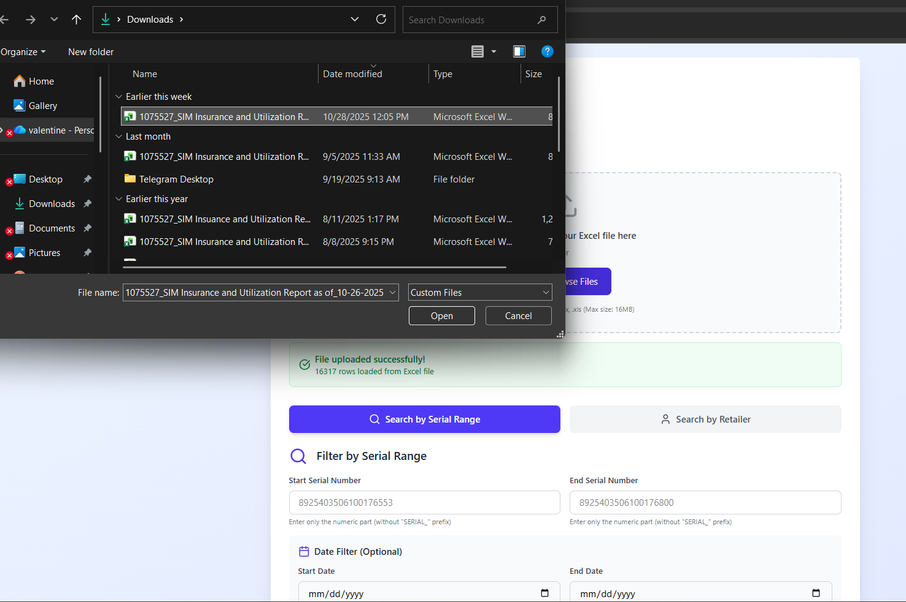
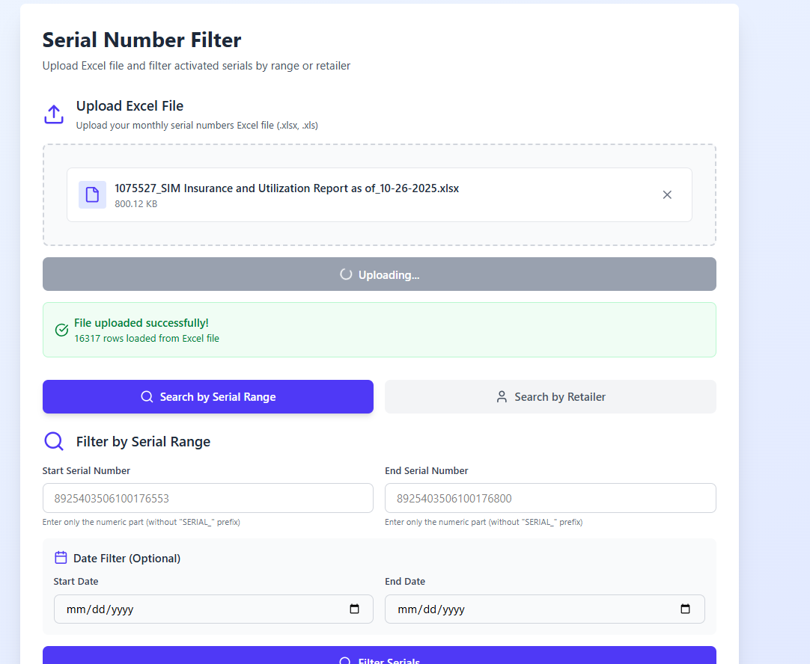
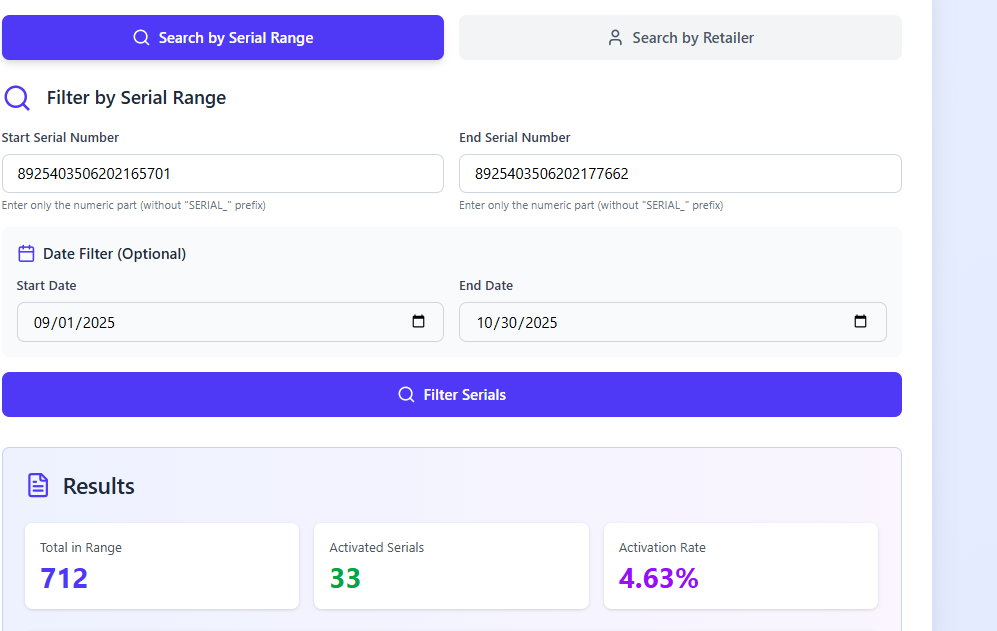

# 📊 SIM Tracker

A full-stack application that filters and analyzes SIM activation data from large Excel datasets. The system allows users to input a range of serial numbers and check which ones have been activated based on existing records. It’s designed for telecom-related operations and inventory validation.

---

## 🧭 Overview

**SIM Tracker** is a data management and analysis platform that helps identify activated SIM cards within a specified range.
The application integrates a **Flask backend** for data processing and a **React frontend** for user interaction.

Users upload or connect to an Excel data source containing serial records, input a range of serial numbers, and the system filters activated entries (where the “served MSISDN” field is not blank).

---

## ⚙️ Architecture

**Architecture:**
- **Frontend:** React + Vite + Tailwind CSS
- **Backend:** Flask (Python)
- **Database:** Excel file (data source)
- **Deployment:** Render (both frontend and backend services)

**Flow:**
React UI → API Request → Flask Endpoint → Pandas Excel Processing → JSON Response → Displayed in React Table

---

## 🚀 Features

- Upload or read Excel files containing serial and activation data
- Input a serial range (e.g. `892543505205677261` - `892543505205677510`)
- Filter activated SIMs where `served_msisdn` is not blank
- Return clean, structured results in JSON format
- Responsive web UI built with React + TailwindCSS
- Backend powered by Flask and Pandas
- Automatic deployment via Render

---

## 🧩 Tech Stack

| Layer | Technology |
|-------|-------------|
| Frontend | React (Vite) |
| Styling | Tailwind CSS |
| Backend | Flask |
| Data Processing | Pandas |
| Data Source | Excel (.xlsx) |
| Deployment | Render |

---

## 🗂️ Folder Structure

```
sim-tracker/
│
├── backend/
│   ├── app.py                 # Flask entry point
│   ├── routes/                # API route handlers
│   ├── utils/                 # Helper functions (Excel parsing, filtering)
│   ├── requirements.txt       # Python dependencies
│   └── uploads/               # Uploaded Excel sheets
│
├── frontend/
│   ├── src/
│   │   ├── components/        # UI components (Table, Range Input, etc.)
│   │   ├── App.jsx            # Main component
│   │   ├── main.jsx           # Entry file for React
│   │   └── services/          # API calls to Flask backend
│   ├── vite.config.js         # Vite configuration
│   ├── package.json           # Frontend dependencies
│   └── index.html             # Root HTML template
│
└── README.md
```

---

## 🔗 API Endpoints

| Method | Endpoint | Description |
|--------|-----------|-------------|
| `POST` | `/filter` | Accepts a serial range and filters activated SIMs |
| `GET`  | `/health` | Health check for the backend API |

### Example Request

```json
POST /filter
{
  "start_serial": "892543505205677261",
  "end_serial": "892543505205677510"
}
```

### Example Response

```json
{
  "activated_serials": [
    {
      "serial_number": "892543505205677263",
      "served_msisdn": "254700123456"
    },
    {
      "serial_number": "892543505205677278",
      "served_msisdn": "254711987654"
    }
  ],
  "count": 2
}
```

---

## 💻 Frontend Overview

- **React** app communicates with Flask API via Fetch.
- Uses **TailwindCSS** for a sleek, responsive design.
- Input field for serial range + table display of filtered results.
- Error and loading states for better UX.

---

## ☁️ Deployment (Render)

The project supports Render deployment for both frontend and backend services.

- **Backend (Flask):**
  Deployed as a Python web service using `pipfile.lock`.

  https://sim-tracker.onrender.com

- **Frontend (React):**
  Deployed as a static site using Vite build output.

  https://sim-tracker-1.onrender.com

Both communicate through Render’s internal networking for seamless integration.

---

## 🧠 Future Improvements

- Add user authentication and session history
- Enable database integration (PostgreSQL) for persistence
- Add export to CSV feature for filtered results
- Include advanced analytics (activation rate, trends, etc.)
- Improve file upload validation and feedback

---

## 📷 Screenshots

1. Landing page

2. Browsing files

3. Uploading

4. Filtering by serial range


## 👤 Author

**Valentine Wanjiru**
Software Engineer | Full Stack Developer

https://valentine-portfolio.onrender.com/

---

## 📝 License

This project is licensed under the MIT License — feel free to use and modify for educational or commercial purposes.